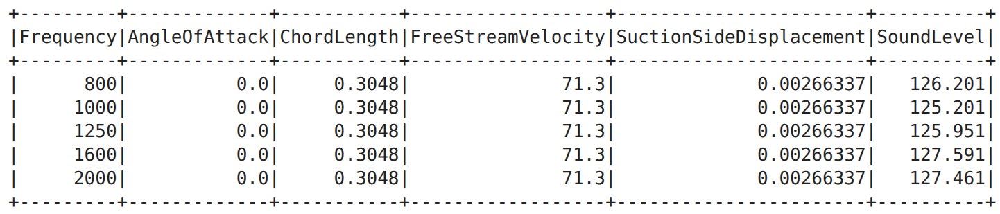

  <h1>✈️ AeroAcoustic ML: Predicting Airfoil Self-Noise with Apache Spark</h1>
  
<strong>An End-to-End Big Data ETL & Machine Learning Pipeline using PySpark</strong>

  

    
    
    
    
  

<h2>📖 1. The Engineering Challenge (The Story)</h2>

In modern aeronautics and high-performance automotive engineering, <strong>aerodynamic noise</strong> is a critical design constraint. As air flows over an airfoil (such as an aircraft wing, turbine blade, or sports car spoiler), turbulence interacts with the blade's trailing edge, generating <strong>airfoil self-noise</strong>.

Testing every new wing prototype inside an acoustic wind tunnel is <strong>expensive, time-consuming, and resource-intensive</strong>.

<strong>💡 The Solution:</strong> 
Instead of relying solely on physical wind tunnel tests for every design iteration, this project builds a <strong>scalable Machine Learning Pipeline using Apache Spark (PySpark)</strong>. By leveraging historical wind tunnel data from <strong>NASA</strong>, our pipeline processes raw aerodynamic measurements, standardizes the features, and trains a predictive model capable of estimating the <strong>Sound Pressure Level (in Decibels)</strong> of an airfoil before it is physically manufactured.

  
  
  
<em>Physical geometry of an airfoil showing airflow behavior and the Angle of Attack (α).</em>

<h2>🏗️ 2. Pipeline Architecture & Workflow</h2>

To ensure the solution can scale from thousands to millions of sensor readings in a distributed environment, the entire workflow is engineered using <strong>PySpark SQL</strong> and <strong>PySpark MLlib</strong>:

| **1. Raw Data** | ➡️ | **2. Spark ETL** | ➡️ | **3. Feature Engineering** | ➡️ | **4. ML Training** | ➡️ | **5. Deployment** |
| :--- | :--- | :--- | :--- | :--- | :--- | :--- | :--- | :--- |
| `CSV` (1,522 rows) |  | Deduplicate & Drop Nulls → `Parquet` (1,499 rows) |  | `VectorAssembler` + `StandardScaler` |  | `LinearRegression` Model |  | Persisted `PipelineModel` |

<h2>🛠️ 3. Data Engineering & ETL Journey</h2>

The dataset used in this project is derived from the <strong>NASA Airfoil Self-Noise Dataset</strong> (obtained from a series of aerodynamic and acoustic tests of two and three-dimensional airfoil blade sections conducted in an anechoic wind tunnel).

<h3>🔹 Feature Dictionary</h3>

| Column Name | Unit | Aerodynamic Description | Role |
| :--- | :--- | :--- | :--- |
| **`Frequency`** | Hz | Acoustic frequency of the generated sound wave. | Input Feature |
| **`AngleOfAttack`** | Degrees (°) | Angle between the airfoil chord line and oncoming airflow (α). | Input Feature |
| **`ChordLength`** | Meters (m) | Distance between the leading edge and trailing edge of the airfoil. | Input Feature |
| **`FreeStreamVelocity`** | m/s | Velocity of the airflow entering the wind tunnel. | Input Feature |
| **`SuctionSideDisplacement`** | Meters (m) | Boundary layer displacement thickness on the suction side. | Input Feature |
| **`SoundLevelDecibels`** | dB | Scaled Sound Pressure Level (Target to predict). | **Target Label** |

<h3>🔹 Raw Data Inspection</h3>

Below is a sample of the ingested raw telemetry data before transformation:

  

<h3>🔹 Data Quality & Optimization Metrics</h3>

During the <strong>ETL (Extract, Transform, Load)</strong> phase, the dataset underwent strict quality checks before being converted to <strong>Apache Parquet</strong> for optimized columnar storage and faster I/O performance:

<ul>
  <li><strong>Initial Raw Records:</strong> <code>1,522</code> rows</li>
  <li><strong>After Deduplication (<code>dropDuplicates</code>):</strong> <code>1,503</code> rows <em>(19 duplicate records removed)</em></li>
  <li><strong>After Null Removal (<code>dropna</code>):</strong> <code>1,499</code> clean rows <em>(4 incomplete records removed)</em></li>
  <li><strong>Schema Standardization:</strong> Renamed target column from <code>SoundLevel</code> to <code>SoundLevelDecibels</code>.</li>
</ul>

<h2>⚙️ 4. Machine Learning Pipeline Construction</h2>

To prevent data leakage and ensure seamless deployment, feature transformations and model training were encapsulated into a unified <strong>3-Stage Spark ML Pipeline</strong> (trained on <strong>70%</strong> of the data and tested on <strong>30%</strong> with <code>seed=42</code>):

<ol>
  <li><strong>Stage 1 — <code>VectorAssembler</code>:</strong> Consolidates the 5 physical and aerodynamic input columns into a single dense feature vector (<code>features</code>).</li>
  <li><strong>Stage 2 — <code>StandardScaler</code>:</strong> Because features vary drastically in scale (e.g., <code>Frequency</code> in thousands of Hz vs. <code>SuctionSideDisplacement</code> in thousandths of a meter), this stage normalizes all features to unit standard deviation (<code>scaledFeatures</code>).</li>
  <li><strong>Stage 3 — <code>LinearRegression</code>:</strong> Fits a multivariate linear regression model mapping the scaled features to <code>SoundLevelDecibels</code>.</li>
</ol>

<h2>📊 5. Model Evaluation & Physical Insights</h2>
<h3>🔹 Regression Performance on Unseen Test Data</h3>

| Evaluation Metric | Value | Interpretation |
| :--- | :--- | :--- |
| **Mean Absolute Error (MAE)** | **`3.73 dB`** | On average, the model's predictions deviate by only ~3.73 decibels from actual wind tunnel measurements. |
| **Mean Squared Error (MSE)** | **`22.59`** | Captures variance and penalizes larger outlier errors (RMSE ≈ 4.75 dB). |
| **R-Squared ($R^2$)** | **`0.54`** | The linear baseline explains **54%** of the variance in acoustic noise across diverse aerodynamic regimes. |
| **Model Intercept ($\beta_0$)** | **`132.60 dB`** | Baseline acoustic level when standardized features are at zero. |

<h3>🔹 Sample Inference (Actual vs. Predicted)</h3>

After persisting the trained pipeline to disk (<code>PipelineModel</code>) and reloading it for production inference, the model generated the following predictions on the test set:

  

<h3>🔹 Aerodynamic Insights from Model Coefficients</h3>

By inspecting the learned weights of the standardized Linear Regression model, we can extract meaningful physical insights into what drives airfoil noise:

| Aerodynamic Feature | Learned Coefficient | Physical & Engineering Impact |
| :--- | :--- | :--- |
| **`Frequency`** | `-3.9728` | **Strongest Inverse Driver:** Higher acoustic frequencies damp out faster and exhibit lower scaled sound pressure levels. |
| **`ChordLength`** | `-3.3818` | **Inverse Relationship:** Larger chord lengths shift the acoustic spectrum, reducing high-frequency trailing-edge noise. |
| **`AngleOfAttack`** | `-2.4775` | **Inverse Component (Coupled):** Interacts closely with boundary layer thickness (`SuctionSideDisplacement`) as flow separation changes. |
| **`SuctionSideDisplacement`** | `-1.6465` | **Boundary Layer Effect:** Reflects the damping and frequency-shifting behavior of thicker turbulent boundary layers. |
| **`FreeStreamVelocity`** | **`+1.5789`** | **Primary Positive Driver:** Faster airflow velocity directly increases kinetic energy and turbulence intensity, raising noise levels (dB). |

<h2>🚀 6. How to Run This Project</h2>

<strong>1. Clone the repository:</strong>

<pre><code>git clone https://github.com/TariqZJawad/-nasa-airfoil-noise-prediction-pyspark.git
cd -nasa-airfoil-noise-prediction-pyspark</code></pre>

<strong>2. Install dependencies:</strong>

<pre><code>pip install pyspark==3.1.2 findspark</code></pre>

<strong>3. Run the Jupyter Notebook or Python Script:</strong> 
Open <code>Airfoil_Noise_Prediction_Pipeline.ipynb</code> in JupyterLab / Google Colab and execute the cells sequentially.

<h2>👨‍💻 Author & Contact</h2>

<strong>Tariq Zeyad Jawad</strong> 
<em>Physics Graduate | Data Engineering & Machine Learning Enthusiast</em>

<ul>
  <li>🌐 <strong>Website:</strong> <a href="https://tariqjawad.com">tariqjawad.com</a></li>
  <li>💼 <strong>LinkedIn:</strong> <a href="https://www.linkedin.com/in/tariq-jawad">linkedin.com/in/tariq-jawad</a></li>
  <li>📧 <strong>Email:</strong> <a href="mailto:tariq.z.jawad4@gmail.com">tariq.z.jawad4@gmail.com</a></li>
</ul>
